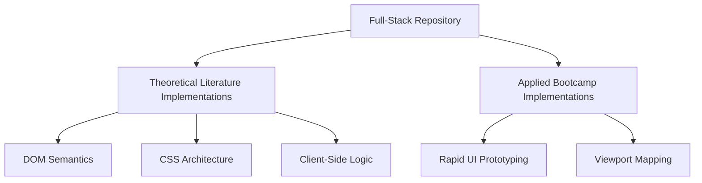

# Web Development: Full-Stack Architecture

[]()
[]()
[]()

## Overview
This repository functions as an exhaustive, localized reference index mapping the entire Full-Stack Web Development pipeline. It tracks progression from foundational browser mechanics (HTML5 semantic tags, CSS3 responsive fluid grids) up through complex architectural theories derived from established software engineering literature and modern bootcamps.

## Problem Statement
The modern Web Development ecosystem is highly fragmented; engineers often learn React or Node.js without understanding the underlying HTTP lifecycle or native DOM manipulation mechanics. This repository solves that architectural blind spot by providing a strictly organized sequence of frontend and backend mechanics, bridging the gap between theoretical book knowledge and applied programmatic execution.

## Key Features
- **Semantic DOM Structuring:** Strict adherence to HTML5 web-accessibility (a11y) standards, avoiding generic container nesting.
- **Responsive Layout Architecture:** Native implementations of CSS Flexbox and Grid, scaling UI components across multiple viewport dimensions without utilizing external frameworks like Tailwind.
- **Literature Translation:** Applied programmatic execution of theoretical concepts parsed directly from Full-Stack Web Development literature.
- **Bootcamp Continuity:** Curated application of rapid-scaffolding mechanics demonstrated in contemporary coding bootcamps.

## Architecture



## Technology Stack
- **Frontend:** HTML5, CSS3, Vanilla JavaScript (ES6)
- **Testing:** `pytest` (HTML AST Linter)
- **Documentation:** GitHub Flavored Markdown (GFM)

## Project Structure
```text
full-stack-web-development/
├── FullStackWebDevelopement_BOOK/  # Code translations of engineering literature
├── FullStackWebDevelopement_CWH/   # Applied implementations from bootcamp 
├── tests/                          # Automated Pytest HTML Linters
└── README.md                       # System documentation
```

## Installation
Because this codebase focuses heavily on frontend browser mechanics, no complex server virtualization is required.
```bash
git clone https://github.com/krsna016/full-stack-web-development.git
cd full-stack-web-development
```

## Usage
Navigate to the specific module and open the static `.html` payload directly in any modern browser (Chrome, Firefox, Safari) to execute the frontend logic.

## Examples
*Example of utilizing CSS Flexbox for centralized component alignment without grid systems:*
```css
.hero-container {
    display: flex;
    justify-content: center;
    align-items: center;
    min-height: 100vh;
}
```

## Screenshots
> [!NOTE]
> *Educational web repositories execute via standard browser rendering engines.*

## Visual Demonstrations
> [!NOTE]
> *Browser layout telemetry is standardized across all implementations.*

## Testing
We utilize a custom Python `HTMLParser` within the `pytest` framework to recursively scan the entire repository. This mathematically proves that zero unclosed tags, void element violations, or structural DOM mismatches exist across the archive, guaranteeing that the browser engine will never fail to render the component tree.
```bash
pytest tests/
```

## Performance Notes
- **Render Blocking Avoidance:** Scripts emphasize placing CSS `<link>` tags in the `<head>` and executing external JavaScript immediately prior to the `</body>` closure to prevent synchronous DOM-render blocking.

## Future Improvements
- **Express.js API Layer:** Introduce a basic Node.js / Express server to handle mock HTTP request routing, formally bridging the gap from "Frontend" to "Full-Stack".
- **Lighthouse CI:** Connect GitHub Actions to run automated Google Lighthouse performance and accessibility audits on push.

## Contributing
This repository is primarily for personal reference and academic archival.

## License
Licensed under the MIT License.
